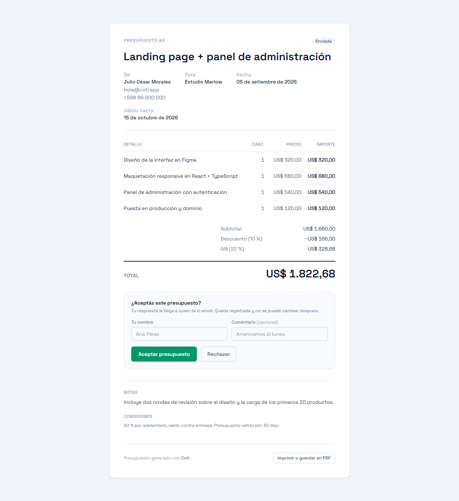
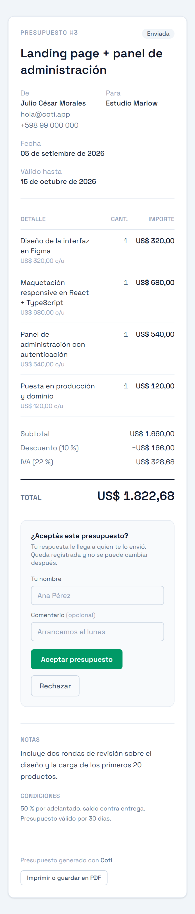
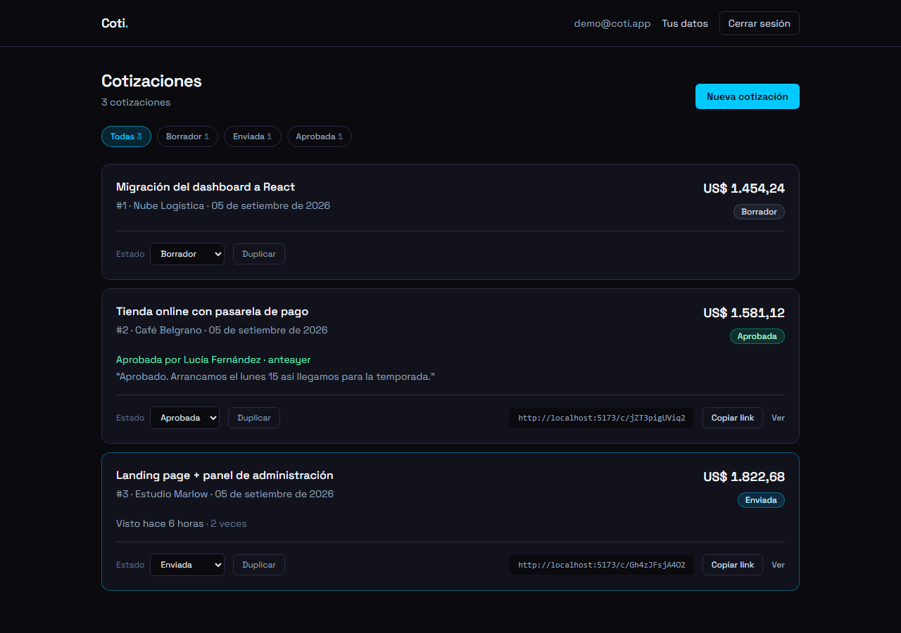
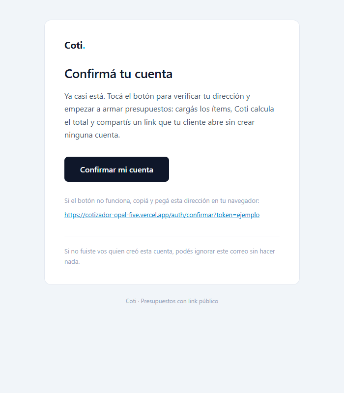

# Coti

Presupuestos con ítems, descuento, IVA y un link público que el cliente **abre, lee y
responde** sin crear ninguna cuenta.

Armás el presupuesto, le ponés los ítems con cantidad y precio, y compartís un link tipo
`/c/QiLn0LfQBdxX`. Tu cliente lo abre desde el celular, ve el desglose y aprieta
**Aceptar** o **Rechazar**. Vos te enterás de que lo abrió y de qué contestó, sin
perseguirlo por WhatsApp.

**[Ver demo](https://cotizador-opal-five.vercel.app)** · Entrá con el botón **“Entrar como demo”**, sin registrarte.

Ejemplo de link público, tal como lo recibe un cliente:
**[cotizador-opal-five.vercel.app/c/Gh4zJFsjA4O2](https://cotizador-opal-five.vercel.app/c/Gh4zJFsjA4O2)**

## Cómo se ve

Lo que abre el cliente, sin cuenta y desde cualquier dispositivo:





Y el panel de quien lo emite:



## Stack

React 19, TypeScript, Vite 7, Tailwind v4, React Router 7 y Supabase (Postgres + Auth).

## Correr

```bash
npm i
cp .env.example .env.local   # completá URL y anon key de tu proyecto Supabase
npm run dev
npm test                     # 37 tests con Vitest
npm run e2e                  # 2 tests de punta a punta con Playwright
```

Para levantar la base de datos, pegá los archivos de `supabase/migrations/` **en orden**
en el SQL editor de Supabase (`0001` levanta el esquema, los siguientes lo van cambiando).

Las capturas de `docs/` se regeneran solas:

```bash
COTI_URL=https://cotizador-opal-five.vercel.app npm run capturas
```

Sin `COTI_URL` apunta al dev server, y entonces los links del panel salen con
`localhost`. Contra la demo desplegada salen con el dominio real.

## Cómo está resuelto el acceso público

Es la parte interesante del proyecto, así que vale la pena explicarla entera. Son dos
mitades simétricas: el visitante sin cuenta tiene que poder **leer** su presupuesto y
tiene que poder **contestarlo**, y ninguna de las dos cosas abre el RLS ni un milímetro.

### Leer sin cuenta

La página `/c/:slug` la abre alguien **sin cuenta**, y aun así no puede ver nada que no
sea el presupuesto exacto cuyo link recibió.

El camino obvio sería una política RLS del estilo `using (estado <> 'borrador')`.
No sirve, por dos motivos:

1. Las políticas permissive se combinan con **OR**. Esa política dejaría que cualquiera
   con la anon key hiciera `select * from cotizaciones` y listara los clientes y los
   títulos de **todos** los usuarios. RLS filtra filas; no puede exigir que quien
   consulta conozca el slug.
2. `items` no tendría política para visitantes anónimos, así que la página pública se
   vería sin líneas y con el total en cero.

La solución es que `anon` **no tenga ninguna política** sobre las tablas — no las lee
nunca — y entre por una única función `security definer` que recibe el slug y devuelve
la cotización con sus ítems ya armada:

```sql
create function public.cotizacion_publica(p_slug text)
returns jsonb
security definer
set search_path = ''
...
where c.slug = p_slug and c.estado <> 'borrador';
```

Detalles que van con eso:

- **El slug es la credencial**, así que son 12 caracteres base64url (72 bits): no se
  enumera a fuerza bruta.
- Un slug **inexistente** y una cotización en **borrador** devuelven exactamente el
  mismo mensaje, para no confirmar desde fuera qué presupuestos existen.
- La función **no devuelve `id` ni `user_id`**: el cliente no necesita identificadores
  internos.
- Un trigger hace el **slug inmutable**: un link ya enviado no cambia porque edites la
  cotización.
- La vista `cotizaciones_con_total` usa `security_invoker = true`; sin esa opción
  correría con permisos del creador y filtraría las cotizaciones de todos.

### Escribir sin cuenta

Aceptar o rechazar es una escritura hecha por alguien que no tiene sesión. Va por el
mismo camino y con la misma idea, `responder_cotizacion(p_slug, p_respuesta, p_nombre,
p_comentario)`, y **toda su seguridad cabe en una línea**:

```sql
update public.cotizaciones
   set estado = p_respuesta, respondido_at = now(), respondido_por = ...
 where slug = p_slug
   and estado = 'enviada';   -- ← esta
```

De ahí sale todo lo demás:

- Un **borrador** no se puede responder, porque para el mundo exterior no existe.
- Una ya respondida **no se puede volver a tocar**. Quien tenga el link no puede darle
  vuelta al resultado ni llenar la tabla a fuerza de reintentos: la primera respuesta
  gana y las demás son no-ops. La operación queda **idempotente sin autenticar a nadie**,
  que es el problema difícil cuando no hay sesión que limitar.
- Devuelve el estado nuevo, o `null` si no aplicaba. "No existe", "está en borrador" y
  "ya la respondieron" dan `null` los tres: desde afuera no se deduce cuál fue.

El modelo de confianza es el mismo que el de la lectura: **el slug es la credencial**.
Quien tiene el link puede leer el presupuesto y puede responderlo, igual que quien recibe
un presupuesto en papel puede firmarlo.

Del lado del panel hay una regla complementaria, en el trigger
`cotizaciones_respuesta_inmutable`: una vez que el cliente contestó, el dueño **no puede
contradecirlo**. Una aprobada puede pasar a cobrada —es el paso siguiente normal— pero no
volver a borrador, y un rechazo no se da vuelta a mano. Si no, la constancia sería un
adorno.

### Saber que lo abrió

`registrar_vista(p_slug)` va aparte y no por gusto: `cotizacion_publica` es `stable` y
una función `stable` **no puede escribir**. Es `volatile`, `security definer`, y tiene
dos filtros que la hacen útil en vez de ruidosa:

- **No cuenta al dueño.** Que abras tu propio link para revisarlo no es "el cliente lo
  vio". Sin eso, "visto hace 2 minutos" mentiría cada vez que mirás cómo quedó.
- **No cuenta las recargas.** Cinco F5 seguidos son una visita, no cinco.

La tabla `vistas` guarda **solo la fecha**: ni IP ni user agent. Para responder "¿lo
abrió?" alcanza con eso, y todo lo demás son datos personales de un tercero que no tiene
cuenta acá ni aceptó ninguna política.

### La anon key

Es pública por diseño y no es una filtración: lo que protege los datos es el RLS y la
ausencia de políticas para `anon`. La clave sola no abre ninguna puerta — está en el
bundle que se descarga cualquier navegador, y está también, a la vista, en el workflow
que mantiene viva la demo.

Lo que sí se sacó del repo es la **configuración de build**: `vercel.json` tenía la URL y
la clave hardcodeadas, y eso ataba cualquier clon del proyecto a la base de la demo. Ahora
`VITE_SUPABASE_URL` y `VITE_SUPABASE_ANON_KEY` son variables de entorno del proyecto en
Vercel, y en local salen de `.env.local`.

La `service_role` key, esa sí secreta, no se usa en ningún lado de este proyecto.

## Cuentas

Registro con confirmación por correo, inicio de sesión y recuperación de contraseña
(pedir el enlace, elegir una nueva y entrar). Hay además una cuenta de demostración con
datos cargados para que se pueda probar sin registrarse.

Cada usuario completa **sus datos** —nombre o negocio, email de contacto y teléfono— y eso
es lo que aparece en el presupuesto que recibe el cliente. Sin eso el documento llegaría
sin decir de quién viene.

## Correos de autenticación

El registro manda un correo de confirmación con la identidad de Coti, no con la del
proveedor. Las plantillas (confirmar cuenta y restablecer contraseña) están en
`supabase/templates/` y se envían por un SMTP propio (Brevo).



Detalles que valen la pena:

- **Supabase no deja editar las plantillas hasta que configurás un SMTP propio.** Con el
  servidor por defecto quedan bloqueadas.
- Y ese servidor por defecto **solo envía a miembros de tu organización**: a cualquier otra
  dirección le responde *"Email address not authorized"*. Es decir, con la configuración
  inicial el registro estaba roto para todo el mundo menos para el dueño del proyecto, y
  sin avisar.
- El **Site URL** hay que apuntarlo al dominio de producción. Viene como
  `http://localhost:3000`, así que el botón del correo llevaría a una página muerta.
- Los correos van con **tablas y estilos en línea**: Gmail y Outlook no soportan flexbox
  ni grid.
- El enlace de confirmación **se invalida al usarse**.

## Tests

**37 con Vitest**, sobre lo que rompería el producto si fallara: el cálculo del dinero y
el editor de ítems.

Los verifiqué rompiendo el código a propósito para ver si fallaban, y ahí apareció un
detalle: el caso típico de `0.1 + 0.2` **no distingue** una implementación con redondeo de
una sin él, porque multiplicado por 100 da 30 exacto en los dos casos. Un test que solo
usara ese ejemplo daría una seguridad falsa. El que sí delata la diferencia es
**7 × 19,99**: sin redondear da `139.92999999999998`, que se imprime como 139,92, un
centavo menos de lo que el cliente suma a mano.

**2 con Playwright**, sobre lo único que ninguna unitaria puede tocar. Las de Vitest
corren con la base mockeada; el ciclo que hace distinto a este proyecto pasa por RLS, por
tres funciones `security definer` y por dos motores de cálculo. El e2e corre contra
Supabase de verdad:

crear el presupuesto → mandarlo → **abrirlo en un contexto de navegador aparte**, sin
sesión ni cookies ni localStorage, como le llega al cliente → comprobar que el total que
calculó Postgres coincide **carácter por carácter** con el que calculó JavaScript en el
editor → ver en el panel que quedó registrado que lo abrieron → aceptar → ver el sello →
comprobar que el selector de estado quedó acotado a "Aprobada / Cobrada".

Limpia lo que crea. Corre en CI, de a uno por vez: dos corridas simultáneas se pelearían
por el correlativo.

## Otras decisiones

- **Guardado transaccional.** Guardar es "reemplazar los ítems". Hacerlo en un `delete`
  y un `insert` sueltos desde el navegador deja el presupuesto sin líneas si la red se
  corta en el medio. Va todo en una función, en una sola transacción.
- **Los importes se suman en centavos enteros.** En coma flotante `0.1 + 0.2` da
  `0.30000000000000004`, y un total que descuadra un centavo respecto al que ve el
  cliente no es aceptable.
- **Un solo cálculo del desglose, escrito dos veces a propósito.** El total lo muestran
  tres pantallas y lo calculan dos motores: `computeTotals` en `src/lib/money.ts` y
  `totales_cotizacion` en la migración 0005. Son gemelos exactos —mismo orden, mismo
  redondeo— porque el editor tiene que mostrar el número mientras se escribe, sin ir a
  la base, y la página pública tiene que mostrar el número que la base calculó.
  Antes de igualarlos discrepaban: la base sumaba `cantidad * precio` sin redondear y el
  navegador redondeaba cada línea, así que con `1,5 × 33,33` la línea se imprimía como
  50,00 y el total como 49,99. La columna de importes no sumaba el total que estaba justo
  abajo, en el documento que el cliente lee para decidir si paga. Que los dos coincidan lo
  vigila el e2e, comparando los dos importes renderizados.
- **El descuento va sobre el subtotal y el IVA sobre el neto.** Para el total el orden da
  igual —dos porcentajes conmutan—, pero el **monto de IVA impreso** no: sobre el neto de
  1.080 son 237,60 y sobre el subtotal de 1.200 serían 264. Quien controla un presupuesto
  mira ese renglón, no solo el total.
- **El número de presupuesto es correlativo por usuario.** Un cliente espera "#14", no un
  uuid. Lo asigna `guardar_cotizacion` con un `max(numero) + 1` que el RLS ya acota a las
  cotizaciones de quien llama; el índice único `(user_id, numero)` es lo que garantiza que
  no se repita si dos altas entran a la vez.
- **El nombre del cliente se guarda dos veces, y no es redundancia.** `cotizaciones.cliente`
  es texto congelado en el momento de emitir; `cliente_id` apunta a la ficha reutilizable.
  Si mañana corregís el nombre en la ficha, un presupuesto ya enviado **no puede cambiar**:
  el documento que la persona abrió tiene que decir siempre lo mismo. Es el mismo criterio
  por el que el slug es inmutable.
- **Clientes sin pantalla de alta.** El campo de siempre con un `<datalist>`: escribís y
  autocompleta los que ya usaste, o escribís uno nuevo y `guardar_cotizacion` lo crea solo.
  Un ABM para tres campos habría sido más código y más clics.
- **El editor avisa antes de perder cambios.** `useBlocker` para la navegación interna y
  `beforeunload` para cerrar la pestaña o recargar. Eso obliga a un router de datos
  (`createBrowserRouter`): con `<BrowserRouter>` el hook lanza excepción. La comparación es
  contra lo que se guardaría y no contra lo que hay en pantalla, así que agregar una fila
  vacía o escribir `5,00` donde decía `5` no dispara el aviso. Cerrar sesión sí sale sin
  preguntar: bloquear esa navegación te deja sin sesión y sin poder salir del editor.
- **El filtro por estado vive en la URL.** `?estado=enviada` con `useSearchParams`, así
  sobrevive al refresh y al "atrás" del navegador, y se puede compartir.
- **Los inputs numéricos guardan texto, no números.** Si se convirtiera en cada tecla,
  borrar el contenido de un campo lo dejaría en `NaN`.
- **La página pública es imprimible.** `Ctrl+P` da un PDF limpio, sin botones ni barras.
  No hay librería de PDF: los navegadores ya lo hacen bien y jsPDF pesaba más que el resto
  de la aplicación junta.

## Estados

```
borrador → enviada → aprobada → cobrada
                  ↘ rechazada
```

En borrador el link público no muestra nada; hay que pasarla a “enviada” para compartirla.
`aprobada` y `rechazada` las puede poner el cliente desde el link, o el dueño a mano —un
"no" por teléfono también cuenta—, pero una vez que el cliente respondió el panel ya no
puede contradecirlo.

## Sobre el linter de Supabase

El Security Advisor marca que `anon` y `authenticated` pueden ejecutar funciones
`SECURITY DEFINER`: `cotizacion_publica`, `registrar_vista` y `responder_cotizacion`.
**Son intencionales** y son justamente el diseño explicado arriba: esas tres son la puerta
pública, y el linter no puede saber que la exposición es deliberada.

Lo importante es poder decir que **todo lo que quedó expuesto está expuesto a propósito**,
y para eso hubo que arreglar algo que no lo estaba. Las migraciones venían escribiendo,
para cada función:

```sql
revoke all on function ... from public;
grant execute on function ... to authenticated;
```

y **eso no alcanza en Supabase**. `revoke ... from public` saca el permiso del pseudo-rol
`PUBLIC`, que es el que otorga Postgres por defecto. Pero Supabase deja configurado además
un `alter default privileges ... grant execute on functions to anon, authenticated`, así
que cada función nueva nace con un grant **explícito** a `anon` que el revoke a `PUBLIC`
ni roza. Resultado: `guardar_cotizacion`, `duplicar_cotizacion` y `totales_cotizacion`
quedaban publicadas en `/rest/v1/rpc/…` para cualquiera con la anon key.

No era explotable, y vale la pena entender **por qué**: las tres son `security invoker`,
así que corrían como `anon` y el RLS las frenaba —`guardar_cotizacion` moría con *"new row
violates row-level security policy"*—. Si alguna hubiera sido `security definer`, el mismo
descuido era un agujero de verdad. La defensa que funcionó fue el RLS, no el grant. La
migración `0008` repone la que faltaba, revocando a `anon` por nombre.

Lo que importa además: no aparece ningún aviso de tabla sin RLS.

Queda un aviso que **no se puede cerrar**: *protección contra contraseñas filtradas
desactivada*. Supabase la implementa consultando HaveIBeenPwned y la reserva para planes
pagos; este proyecto está en el plan free, así que el switch existe en el dashboard pero
rechaza guardarse. No es un descuido: es el límite del plan.

Lo que sí hay del lado de las contraseñas es el mínimo de 6 caracteres que pide el
formulario con `minLength`, y el que aplica Supabase del lado del servidor. El primero
es validación de navegador: evita el error honesto, no a alguien decidido. El que cuenta
es el segundo.
